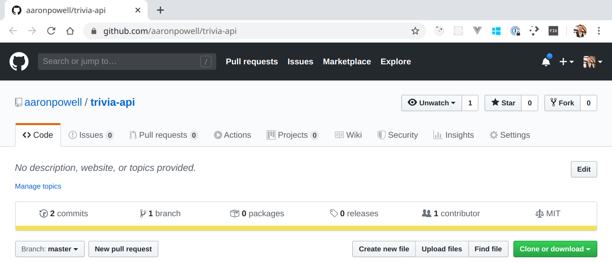
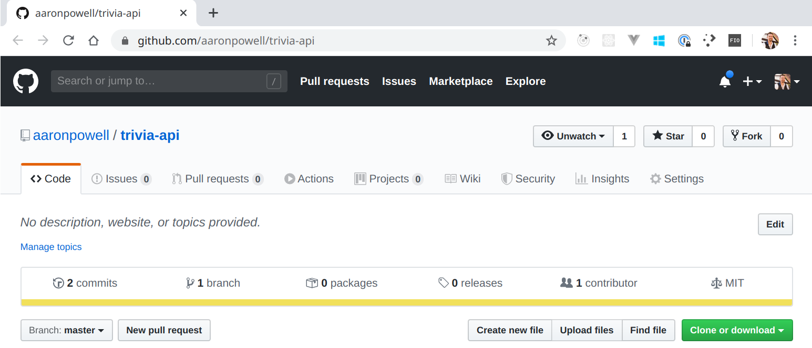
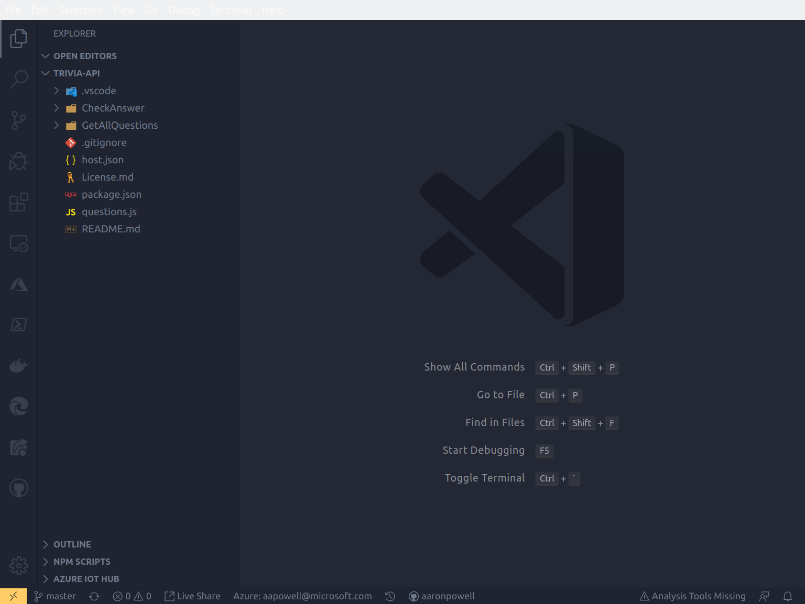
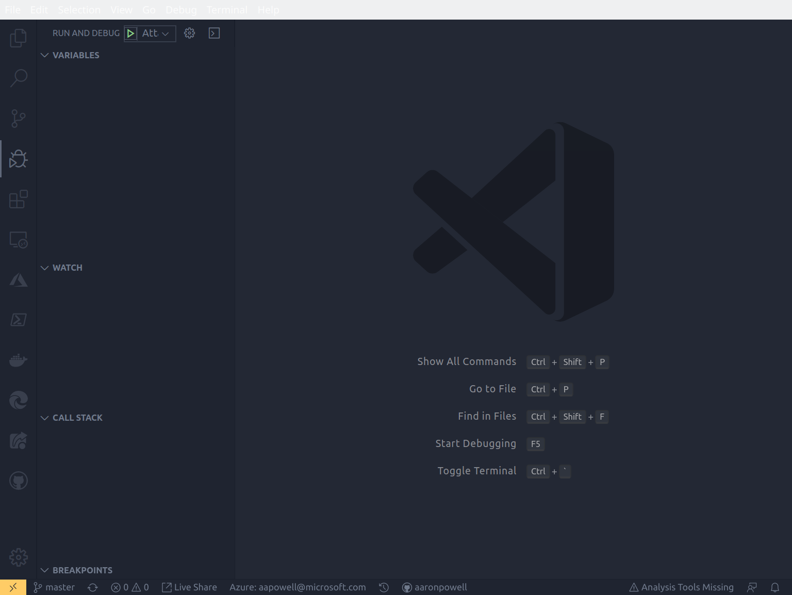
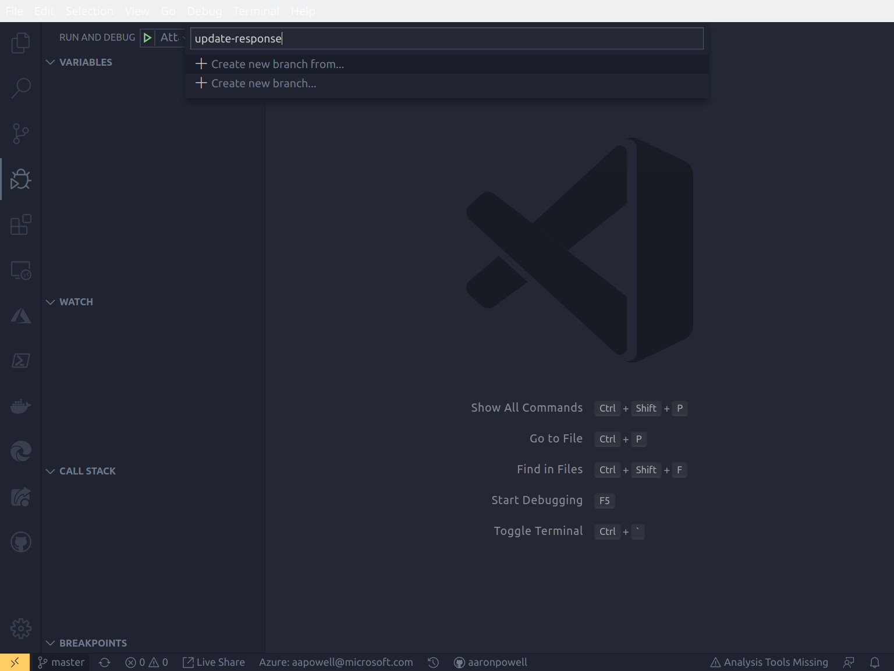
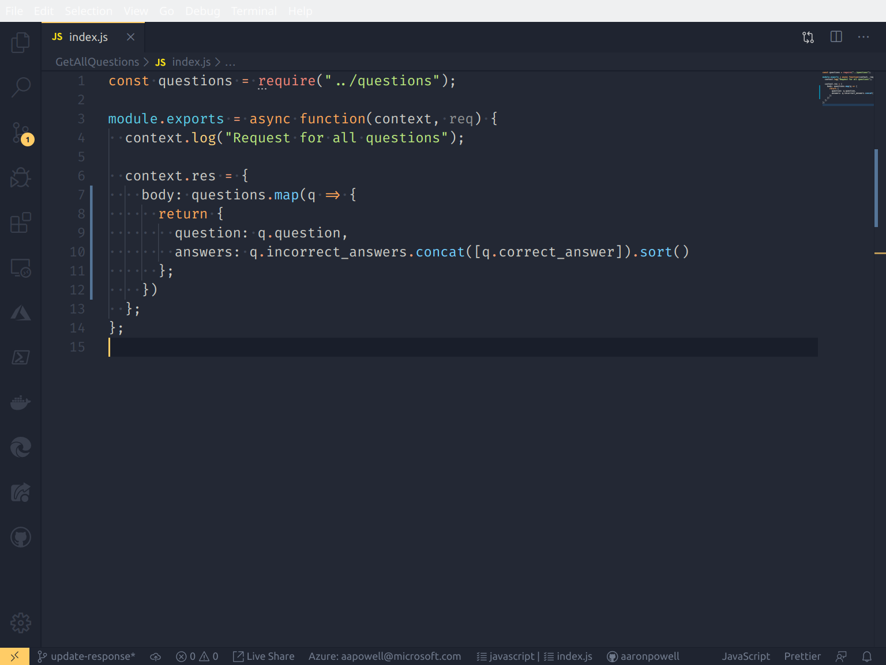
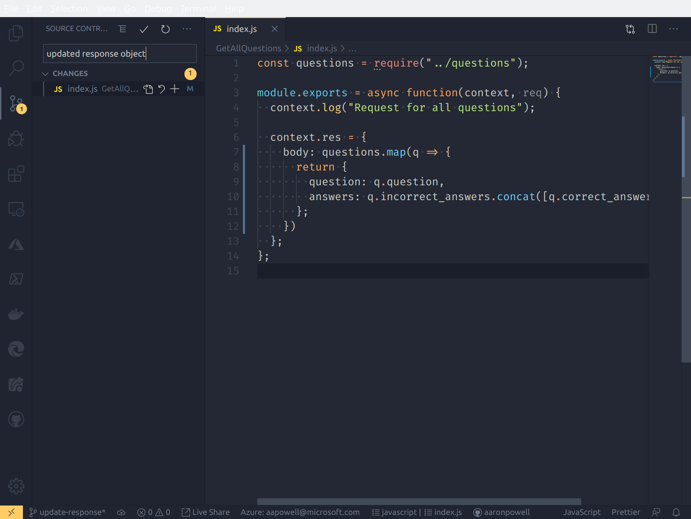
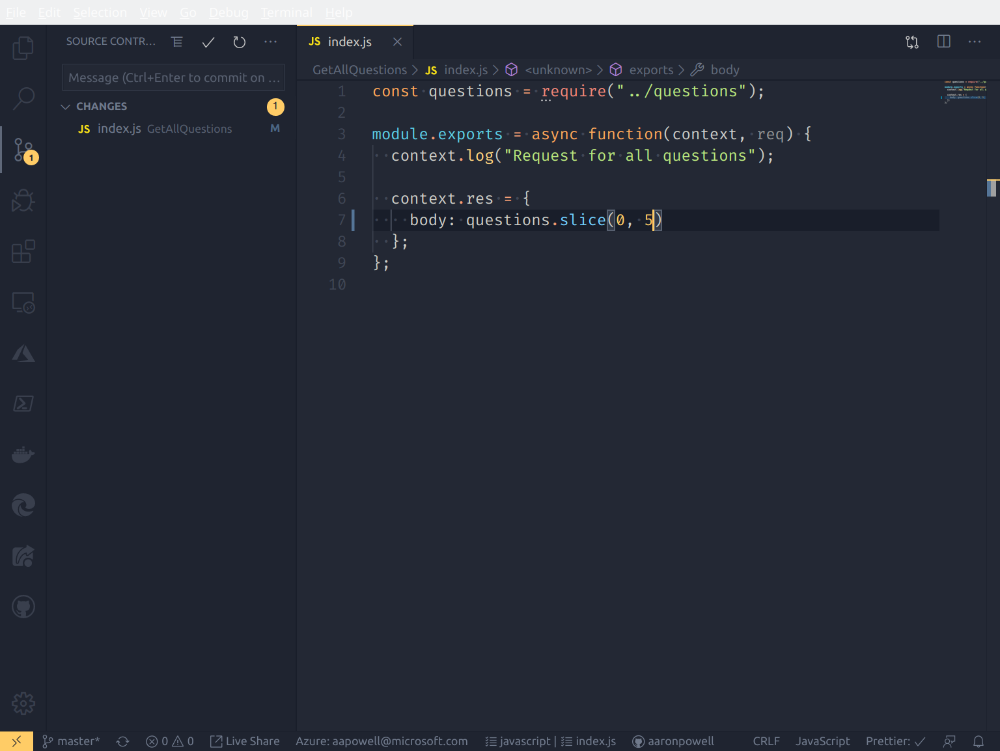
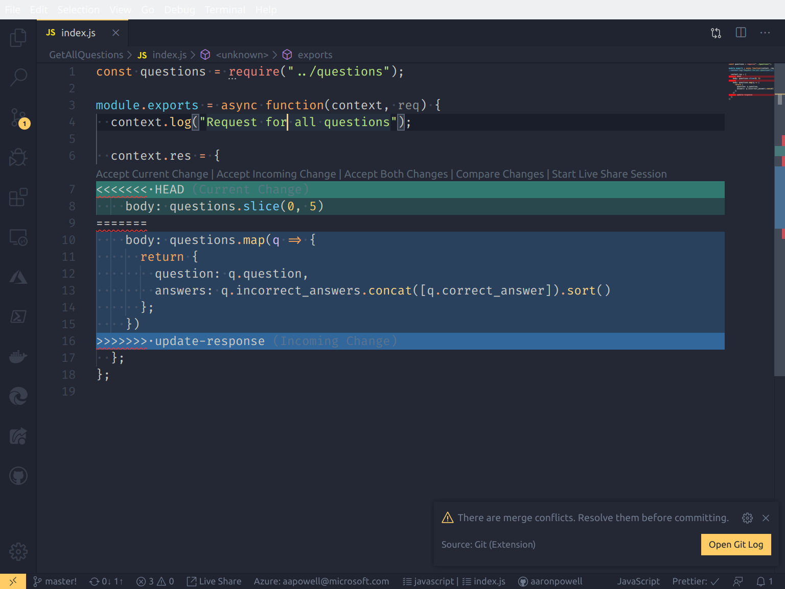
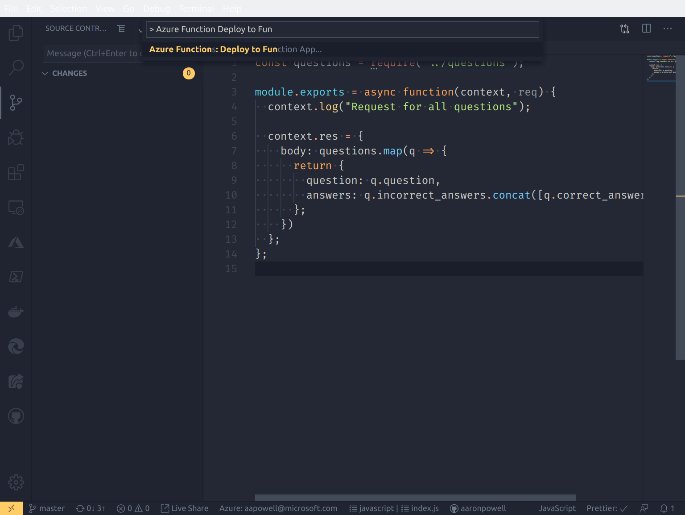

# Working With Azure Functions in VS Code and GitHub

## Overview

**Azure Functions** is a Serverless component from Microsoft that allows you to create event-based functions that can be dynamically scaled to meet the demand. We can work with all kinds of events such as when a file is uploaded to storage, a message appears in the queue or a HTTP request is received.

Using GitHub we can take an existing application, fork it to our account and then create our own version of the application, all from within VS Code.

## What's covered in this lab

In this lab, you will:

1. Fork an existing Azure Functions project on GitHub
2. Learn how to create and merge branches in VS Code
3. Debug Functions with VS Code
4. Deploy Functions to Azure from VS Code

## Prerequisites

1. You'll need VS Code with Azure Functions extension, Node.js and the Azure Functions Core Tools npm module.
2. You are using a GitHub account and an Azure account made for the purpose of this lab. These have already been logged into your machine and the account info is saved.

## Setting up the GitHub repo

1. Navigate to the [example app repository](https://github.com/aaronpowell/trivia-api).
2. Click the "Fork" button in the upper-right hand corner of the repository.

3. From the forked repository, click the green "Clone" button and copy the URL.

4. In VS Code open the Command Pallet (Ctrl/Cmd + Shift + P) and type **Git clone**, select the command and paste in the URL copied in step 3 and select a folder on disk to clone to.

## Running and Debugging with VS Code

1. Click "Run and Debug" from the Activity Bar (Ctrl/Cmd + Shift + D)

2. Click "Start Debugging" (F5)

3. Add a breakpoint to line 4 of `GetAllQuestions/index.js`
4. Open a browser and navigate to http://localhost:7071/api/GetAllQuestions
5. Observe the breakpoint being hit in VS Code, then press F5 to continue execution

## Create a branch

1. Click 'master' in the Status Bar and enter the name for a new branch (e.g.: bugfix)

2. Edit `GetAllQuestions/index.js` to return the question and possible answers, without indicating the correct answer

3. Click "Source Control" from the Activity Bar (Ctrl/Cmd + Shift + G) and enter a commit message for the change

## Update master branch

1. Use the Status Bar to navigate back to the 'master' branch
2. Edit GetAllQuestions/index.js to only return the first 5 questions in the response

3. Click "Source Control" from the Activity Bar (Ctrl/Cmd + Shift + G) and enter a commit message for the change
4. Open the Command Pallet (Ctrl/Cmd + Shift + P) and select "Git: Merge Branch", selecting your branch from the previous exercise
5. Select "Accept incoming Changes" in the Merge Conflict window

6. Open the Command Pallet (Ctrl/Cmd + Shift + P) and select "Git: Delete Branch", selecting your branch from the previous exercise
7. Click "Source Control" from the Activity Bar (Ctrl/Cmd + Shift + G) and commit the merge to the git repo
7. Open the Command Pallet (Ctrl/Cmd + Shift + P) and select "Git: Push" to publish to GitHub

## Deploying to Azure

1. Open the Command Pallet (Ctrl/Cmd + Shift + P) and select "Azure Functions: Deploy to Function App"

2. Follow the wizard providing information along the way for:

- Select your subscription
- Function App Name (eg: YOUR_NAME-jsghfunctions)
- Node.js runtime (12.x)
- Azure Region (Pick one close to you, e.g.: Australia East)

3. It will take a minute or two to create the app. Once it's done, you'll get prompted with the URL of the deployed app, which you can navigate to in the browser
4. Open up the [Azure Portal](https://portal.azure.com) and navigate to your subscription -> resource group -> Function App to view the deployed app in Azure

## Next steps

Complete our [survey](https://aka.ms/js19) to register your completion!

If you'd like to try more labs:

- [Sample app with an Angular front end connected to Azure Functions](https://github.com/fiveisprime/apm)
