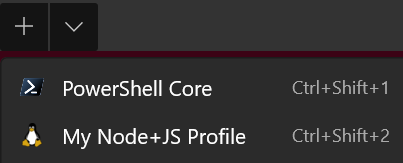

# Windows for Open Source Developers

This project walks you through setting up and customizing a Windows PC for Open Source development.  We'll introduce you to Windows Terminal and the Windows Subsystem for Linux (WSL) 2. At the end of this lab you'll use VS Code to debug a NodeJS project running in WSL.

## Prerequisites

If you are **not** at an event, please see [REQUIREMENTS](REQUIREMENTS.md) to install the prerequisites for this lab.

## Configure the Windows Terminal

### PROFILES

Open Windows Terminal (found in taskbar). Press **Ctrl+,** to edit the settings file (or use the Terminal menu and select "settings")

Scroll down to `"profiles"`. Insert the profile below after the first `[`: <br/>
```json
{
    "guid" : "{c6eaf9f4-56a1-5fdc-b5cf-066e8a4b1e40}",
    "acrylicOpacity" : 0.5,
    "closeOnExit" : true,
    "colorScheme" : "Campbell",
    "commandline" : "wsl.exe -d Ubuntu-18.04",
    "cursorColor" : "#FFFFFF",
    "cursorShape" : "bar",
    "fontFace" : "Cascadia Code",
    "fontSize" : 12,
    "historySize" : 9001,
    "icon" : "ms-appx:///ProfileIcons/{9acb9455-ca41-5af7-950f-6bca1bc9722f}.png",
    "name" : "My Node+JS Profile",
    "padding" : "4, 2, 4, 2",
    "snapOnInput" : true,
    "useAcrylic" : false

},
```
Save the changes. **Ctrl+S**

On the Windows Terminal, select the down arrow next to the plus(+) sign as shown in this image. In the drop down, select: `My Node+JS Profile`.



This profile will open an Ubuntu 18 bash shell.

Feel free to change any of the profile settings and the Terminal will automatically reload with your changes as you make them.

### POWERLINE FONT
Next change your terminal profile to use a Powerline font.  Pick one of the following:

`"fontFace" : "Space Mono for Powerline",`<br/>
`"fontFace" : "Noto Mono for Powerline",` <br/>
`"fontFace" : "ProFont for Powerline",` <br/>

Save the changes. **Ctrl+S**

### POWERLINE SHELL
With the fonts installed, you can install the PowerLine shell in Ubuntu.  We've downloaded the powerline-shell for you so all you need to do is add an entry to the .bashrc.

Open Windows File Explorer.
In the Address bar enter `\\wsl$\Ubuntu-18.04\home\jsinteractive`
Edit (Double-click) .bashrc -> Opens in VS Code
Add the following:

```bash
function _update_ps1() {
    PS1=$(powerline-shell $?)
}

if [[ $TERM != linux && ! $PROMPT_COMMAND =~ _update_ps1 ]]; then
    PROMPT_COMMAND="_update_ps1; $PROMPT_COMMAND"
fi
```
Save the changes using **Ctrl+S**, close the WSL tab and reopen it to see the changes.

## TMUX

To have multiple panes within our Ubuntu 18 shell we can use Tmux.  Here's how:
<!---
From the Ubuntu 18 shell run `sudo apt install tmux -y` (password: oscon)
Installing this before hand, so they won't need to install.
-->
1. Open the Ubuntu 18 shell.
2. Start a new tmux session by typing `tmux` and pressing enter.
3. Add panes using the following:
    - Press **CTRL+B** and then **"** to split the screen vertically
    - Press **CTRL+B** and then **%** to split the screen horizontally
    - Use **CTRL+B** and then the arrow keys to navigate between the screens
    - Use whatever mix and match of cool apps you'd like here. I recommend using `htop` in the top Window, `cmatrix` on the bottom left and `cacafire`
    - To quit a window press **CTRL+B** and then **x** and then press **y** to accept
    - Quit all windows to exit the tmux session

## Run a Node Project in WSL

In the Terminal using your Node+JS profile, navigate to
 `~\projects\`
1. run `cd node-shopping-cart`
2. run `npm install`
3. run `npm start`
4. Use a web browser to open <http://localhost:3000> to see the site is working.  You are now running  the Linux version of NodeJS locally on Windows via WSL.

### Debug the Node Project with VS Code
1. While still in the Node+JS profile in Terminal, close the previous running instance of NodeJS if you haven't already. We're now going to start the same project using VS Code.
2. Navigate to the '`\projects\nodejs-shopping-cart` directory and type `code .` to open the project in VS Code.
3. This opens VS Code on Windows with a feature to debug the NodeJS project running in WSL.
4. In VS Code you can run the debugger and use breakpoints.  You're using a Windows code editor/debugger for a project running the Linux NodeJS. Pretty cool!

## Customize Windows Terminal

Let's make the Node+JS profile look more like Ubuntu. Using your Node+JS profile, update the properties below in the JSON. As you update your profile, the Terminal will automatically reflect your changes.
1. Set `"useAcrylic" : false,`
2. Set `"fontFace" : "Ubuntu Mono",`
3. Set `"fontSize" : 14,`
4. Set `"colorScheme" : "One Half Dark",`
5. Set `"cursorShape" : "filledBox",`
6. Add `"backgroundImage" : "ms-appdata:///roaming/ubuntu.jpg",`
7. Add `"backgroundImageOpacity" : 0.8,`
8. Add `"tabTitle" : "Ubuntu 18.04",`
9. Add `"suppressApplicationTitle" : true`

After adding these changes, your profile should look like this:
```json
{
    "guid" : "{c6eaf9f4-56a1-5fdc-b5cf-066e8a4b1e40}",
    "acrylicOpacity" : 0.5,
    "closeOnExit" : true,
    "colorScheme" : "One Half Dark",
    "commandline" : "wsl.exe -d Ubuntu-18.04",
    "cursorColor" : "#FFFFFF",
    "cursorShape" : "filledBox",
    "fontFace" : "Ubuntu Mono",
    "fontSize" : 14,
    "historySize" : 9001,
    "icon" : "ms-appx:///ProfileIcons/{9acb9455-ca41-5af7-950f-6bca1bc9722f}.png",
    "name" : "My Node+JS Profile",
    "padding" : "4, 2, 4, 2",
    "snapOnInput" : true,
    "useAcrylic" : false,
    "backgroundImage" : "ms-appdata:///roaming/ubuntu.jpg",
    "backgroundImageOpacity" : 0.8,
    "tabTitle" : "Ubuntu 18.04",
    "suppressApplicationTitle" : true
},
```

Documentation for the settings in the profiles.json file can be found here: https://github.com/microsoft/terminal/blob/master/doc/cascadia/SettingsSchema.md

### Thank you

Thank you for trying out Windows Terminal and WSL. Complete our [survey](https://aka.ms/js19) to register your completion!

 To learn more, please check out the following resources.
- https://aka.ms/learnwsl
- https://github.com/microsoft/terminal
- https://code.visualstudio.com/docs/remote/wsl
