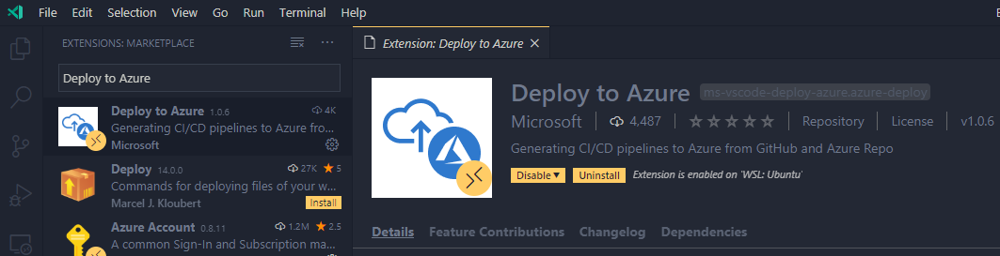

# Deploying Azure Functions using GitHub Actions and VS Code

## Overview

**GitHub Actions** gives you the flexibility to build an automated software development lifecycle workflow. You can write individual tasks ("Actions") and combine them to create a custom workflow. Workflows are configurable automated processes that you can set up in your repository to build, test, package, release, or deploy any project on GitHub.

With **GitHub Actions** you can build end-to-end continuous integration (CI) and continuous deployment (CD) capabilities directly in your repository.

### What’s covered in this lab

In this lab, you will:

1. Create a workflow with GitHub Actions to add CI/CD to your app using the Deploy to Azure extension
1. Deploy the Functions App to Azure

### Prerequisites

1. Your Windows machine should have Node.js LTS and Visual Studio Code (VS Code).
1. An Azure account with an active subscription. If you don't have one, you can [create an account for free](https://azure.microsoft.com/free/).
1. A GitHub account. If you don't have one, you can [create an account for free](https://github.com/join).
1. The application from [lab 1](../1-vscode-serverless).

## Set up CI/CD with GitHub Actions

Use GitHub Actions to automate the deployment workflow for this Functions app.

1. Open the application from [lab 1](../1-vscode-serverless) in VS Code

1. Install the [Deploy to Azure](https://marketplace.visualstudio.com/items?itemName=ms-vscode-deploy-azure.azure-deploy&WT.mc_id=tutorial-github-aapowell) extension in VS Code.



1. Open the Command Pallet (Ctrl/Cmd + Shift + P) and select "Deploy to Azure: Configure CI/CD Pipeline".


1. Follow the prompts to select your subscription, use the pipeline template "Node.js Function App on Azure Functions" and select your resource group.

1. To create a GitHub Personal Access Token (PAT) you need to navigate in your browser to your GitHub Settings -> Developer Settings -> [Personal Access Tokens](https://github.com/settings/tokens) and click "Generate Token".


1. Provide a name for the PAT select all the _repo_ scopes.


1. Click **Generate token** and copy the PAT to VS Code where the extension is prompting for it. This will generate a GitHub Actions workflow for you.

1. Click "Source Control" from the Activity Bar (Ctrl/Cmd + Shift + G) and enter a commit message for the change.

1. Open the Command Pallet (Ctrl/Cmd + Shift + P) and select "Git: Push" to publish to GitHub.

1. While the Action is being queued, let's get into the details of what this workflow is actually doing. Go to the `.github/workflows/workflow.yml` file to follow along.

   - **Workflow Triggers (line 5)**: Your workflow is set up to run on "push" events to the branch

   ```yaml
   on:
     push:
       branches:
         - master
   ```

   > For more information, see [Events that trigger workflows](https://help.github.com/articles/events-that-trigger-workflows).

   - **Running your jobs on hosted runners (line 12):** GitHub Actions provides hosted runners for Linux, Windows, and macOS. We specify the hosted runner in our workflow as below.

   ```yaml
   jobs:
     build-and-deploy:
       runs-on: windows-2019
   ```

   - **Using an action (line 16)**: Actions are reusable units of code that can be built and distributed by anyone on GitHub. To use an action, you must specify the repository that contains the action. This shows the action to get the code from our current repo.

   ```yml
   - uses: actions/checkout@master
   ```

   - **Using variables and secrets (line 19)**: Sometimes we might want to store a secret, such as our Azure credentials, or just have a reusable variable defined. The `${{ ... }}` syntax denotes a variable and `secret.SOMETHING` is a secret stored in GitHub and won't appear in the logs. This action performs an authentication to Azure so we can run future Actions against it.

   ```yaml
   - uses: azure/login@v1
     with:
       creds: ${{ secrets.AZURE_CREDENTIALS_7870b2dc }}
   ```

   > For more information, see [Using variables and secrets in a workflow](https://help.github.com/en/actions/configuring-and-managing-workflows/using-variables-and-secrets-in-a-workflow).

   - **Running a command (line 23)**: You can run commands on the job's virtual machine. This action is running the npm commands below to install the dependencies, build the application, and run the tests.

   ```yaml
   - name: 'Run npm'
      shell: bash
      working-directory: .
      run: |
        # If your function app project is not located in your repository's root
        # Please change your directory for npm in pushd
        pushd .
        npm install
        npm run build --if-present
        npm run test --if-present
        popd
   ```

   > For workflow syntax for GitHub Actions see [here](https://help.github.com/en/github/automating-your-workflow-with-github-actions/workflow-syntax-for-github-actions)

1. In the browser, navigate to your GitHub repo and select the Actions tab to view the Action.


1. Open up the [Azure Portal](https://portal.azure.com?WT.mc_id=tutorial-github-aapowell) and navigate to your subscription -> resource group -> Function App to view the deployed app in Azure.

1. Using the knowledge gained in [lab 1](../1-vscode-serverless), make some changes and merge to the `master` branch then push to GitHub and watch the Action trigger for each push.