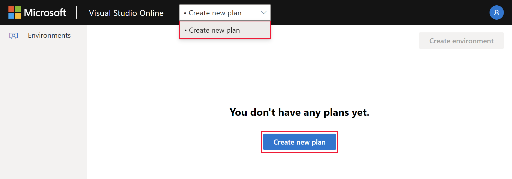
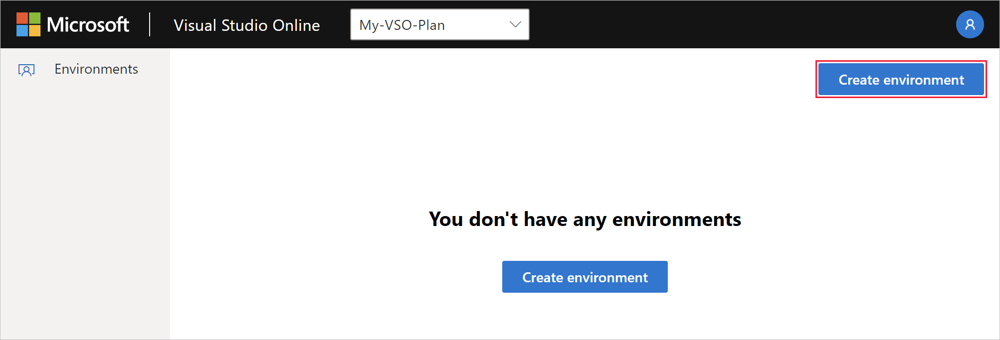
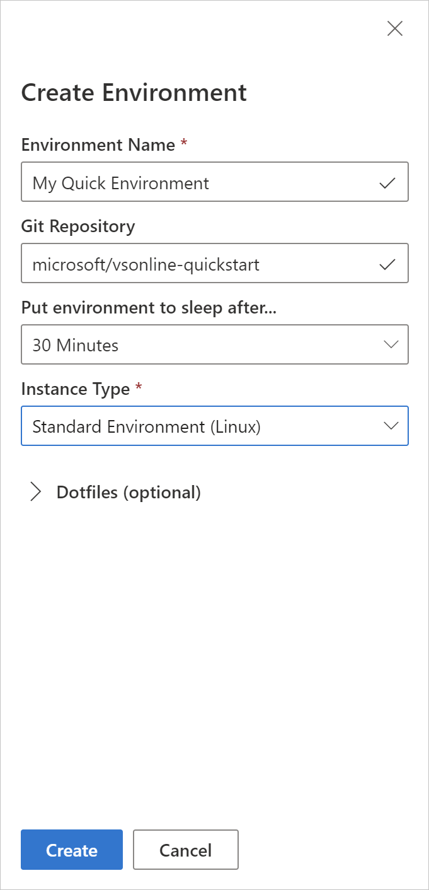

# Deploying a Node.js Web App using GitHub Actions

## Overview

## 1. Launch Visual Studio Online

Browse to the [Visual Studio Online](https://online.visualstudio.com/environments). If you're prompted to sign in, contact a proctor to get you signed in.

## 2. Create a plan

A VS Online plan is required to create VS Online environments. To create a new plan and either use the blue **Create new plan** button, or by click the **Create new plan** in the **Plan Selector** menu in the header bar.

Fill in the form with the following information:

- **Subscription**: Choose any existing Azure subscription you'd like.
- **Resource Group**: Choose any existing Azure resource group you'd like.
- **Region**: Choose the supported regions geographically closest to you. Supported regions are:
  - East US
  - Southeast Asia
  - West Europe
  - West US 2
- **Plan Name**: My-VSO-Plan

Once a plan is created, it will be the selected plan in the **Plan Selector**.

## 3. Create an Environment

To create a new cloud-hosted environment in VS Online select the **Create environment** button in the VS Online management portal.

Complete the form with the following values:

- **Environment Name**: My Quick Environment
- **Git Repository**: microsoft/vsonline-quickstart
- **Put environment to sleep after...**: 30 minutes
- **Instance Type**: Standard Environment (Linux)

A card with the name **My Quick Environment** will appear in the management portal with a status badge of **Creating**.

## 4. Connect To and Use the Environment

Once the green **Available** status badge appears on the environment card, click **My Quick Environment** to connect.

Once connected, open **Readme.md** from **File Explorer**, and then press [`ctrl`]+[`shift`]+[`V`] to render the markdown file.

Follow the instructions in **Readme.md** to complete the lab.
